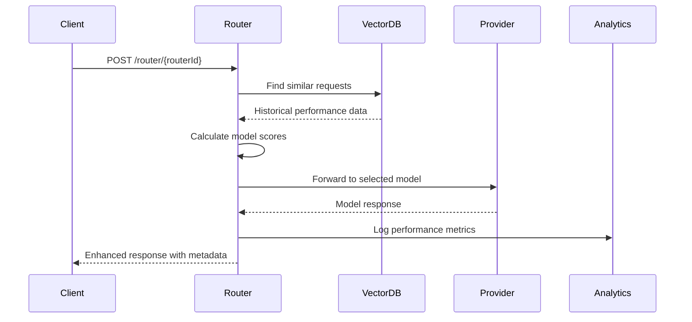

# Backend Architecture

Understanding how ModelPilot's intelligent routing system works under the hood.

## 🏗️ System Overview

ModelPilot's backend is built on Firebase and consists of several key components working together to provide intelligent AI model routing.

```
┌─────────────────┐    ┌─────────────────┐    ┌─────────────────┐
│   Client Apps   │    │  ModelPilot     │    │   AI Models     │
│                 │    │   Platform      │    │                 │
│  ┌───────────┐  │    │  ┌───────────┐  │    │  ┌───────────┐  │
│  │ NPM Pkg   │──┼────┼──│ Router    │──┼────┼──│ OpenAI    │  │
│  │ Web App   │  │    │  │ Engine    │  │    │  │ Anthropic │  │
│  │ Mobile    │  │    │  │           │  │    │  │ Google    │  │
│  └───────────┘  │    │  └───────────┘  │    │  │ +100 more│  │
└─────────────────┘    │  ┌───────────┐  │    │  └───────────┘  │
                       │  │Dashboard  │  │    └─────────────────┘
                       │  │Analytics  │  │    
                       │  └───────────┘  │    
                       └─────────────────┘    
```

## 🧠 Core Components

### 1. Router Engine

The heart of ModelPilot's intelligent routing system.

#### Smart Router Algorithm
```javascript
function selectOptimalModel(request, availableModels, weights) {
  const scores = availableModels.map(model => {
    const costScore = calculateCostScore(model, request);
    const latencyScore = calculateLatencyScore(model, request);
    const qualityScore = calculateQualityScore(model, request);
    const carbonScore = calculateCarbonScore(model, request);
    
    return {
      model,
      totalScore: (
        costScore * weights.costWeight +
        latencyScore * weights.latencyWeight +
        qualityScore * weights.qualityWeight +
        carbonScore * weights.carbonWeight
      )
    };
  });
  
  return scores.sort((a, b) => b.totalScore - a.totalScore)[0].model;
}
```

#### Capability Matrix
The system maintains a comprehensive capability matrix for all models:

```javascript
{
  "gpt-4": {
    "capabilities": ["chat", "functions", "vision"],
    "performance": {
      "avgLatency": 2500,
      "costPerInputToken": 0.03,
      "costPerOutputToken": 0.06,
      "qualityScore": 0.95
    },
    "limits": {
      "maxTokens": 8192,
      "contextWindow": 128000
    }
  },
  "claude-3-sonnet": {
    "capabilities": ["chat", "functions", "analysis"],
    "performance": {
      "avgLatency": 1800,
      "costPerInputToken": 0.015,
      "costPerOutputToken": 0.075,
      "qualityScore": 0.92
    }
  }
}
```

### 2. Firebase Functions Architecture

#### Core Functions

**Router Handler** (`router.js`)
```javascript
exports.routerHandler = functions.https.onRequest(async (req, res) => {
  const { routerId } = req.params;
  const router = await getRouter(routerId);
  
  if (router.mode === 'smartRouter') {
    const selectedModel = await selectOptimalModel(req.body, router);
    return await forwardToProvider(selectedModel, req.body);
  } else {
    return await forwardToProvider(router.preferredModel, req.body);
  }
});
```

**Model Selection** (`smartRouter.js`)
```javascript
exports.selectModel = async (request, routerConfig) => {
  const availableModels = await getAvailableModels(routerConfig.availableModels);
  const requestEmbedding = await generateEmbedding(request.messages);
  
  // Retrieval-based selection using vector similarity
  const similarRequests = await vectorStore.query({
    vector: requestEmbedding,
    topK: 10,
    includeMetadata: true
  });
  
  // Combine historical performance with current optimization weights
  const modelScores = calculateModelScores(
    availableModels,
    similarRequests,
    routerConfig.objective
  );
  
  return selectBestModel(modelScores);
};
```

**Fallback Handler** (`fallbackHandler.js`)
```javascript
exports.handleFallback = async (originalRequest, error, routerConfig) => {
  const fallbackModels = routerConfig.fallbackStrategy.fallbackModels;
  
  for (let attempt = 0; attempt < routerConfig.fallbackStrategy.retryAttempts; attempt++) {
    try {
      const fallbackModel = fallbackModels[attempt % fallbackModels.length];
      return await forwardToProvider(fallbackModel, originalRequest);
    } catch (fallbackError) {
      if (attempt === routerConfig.fallbackStrategy.retryAttempts - 1) {
        throw fallbackError;
      }
      await delay(1000 * Math.pow(2, attempt)); // Exponential backoff
    }
  }
};
```

### 3. Provider Integration

#### Provider Architecture
```javascript
// providers/index.js
const providers = {
  openai: require('./openai'),
  anthropic: require('./anthropic'),
  google: require('./google'),
  openrouter: require('./openrouter')
};

function getProviderHandler(provider, callFormat = null) {
  if (callFormat === 'openrouter') {
    return providers.openrouter;
  }
  return providers[provider] || providers.openai;
}
```

#### OpenAI Provider Example
```javascript
// providers/openai.js
exports.createCompletion = async (model, payload, apiKey) => {
  const response = await axios.post('https://api.openai.com/v1/chat/completions', {
    model,
    ...payload
  }, {
    headers: {
      'Authorization': `Bearer ${apiKey}`,
      'Content-Type': 'application/json'
    }
  });
  
  return {
    ...response.data,
    modelpilot: {
      selectedModel: model,
      provider: 'openai',
      costUsd: calculateCost(response.data.usage, model),
      latencyMs: response.headers['x-response-time']
    }
  };
};
```

### 4. Vector Database Integration

#### Pinecone Integration
```javascript
// ml/vectorStore.js
const pinecone = new Pinecone({
  apiKey: process.env.PINECONE_API_KEY,
  environment: process.env.PINECONE_ENVIRONMENT
});

exports.storePromptPerformance = async (prompt, model, performance) => {
  const embedding = await generateEmbedding(prompt);
  
  await pinecone.upsert({
    vectors: [{
      id: `${prompt.hash}-${model}`,
      values: embedding,
      metadata: {
        model,
        latency: performance.latency,
        cost: performance.cost,
        quality: performance.quality,
        timestamp: Date.now()
      }
    }]
  });
};

exports.findSimilarPrompts = async (prompt, topK = 10) => {
  const embedding = await generateEmbedding(prompt);
  
  const results = await pinecone.query({
    vector: embedding,
    topK,
    includeMetadata: true
  });
  
  return results.matches;
};
```

## 🔄 Request Flow

### 1. Request Processing



### 2. Model Selection Process

```javascript
async function processRequest(routerId, request) {
  // 1. Load router configuration
  const router = await getRouterConfig(routerId);
  
  // 2. Generate request embedding
  const embedding = await generateEmbedding(request.messages);
  
  // 3. Query vector database for similar requests
  const similarRequests = await vectorStore.query({
    vector: embedding,
    topK: 10,
    filter: { routerId }
  });
  
  // 4. Calculate model scores based on historical performance
  const modelScores = router.availableModels.map(model => {
    const historicalPerformance = similarRequests
      .filter(r => r.metadata.model === model)
      .map(r => r.metadata);
    
    return {
      model,
      score: calculateWeightedScore(historicalPerformance, router.objective)
    };
  });
  
  // 5. Select best model
  const selectedModel = modelScores
    .sort((a, b) => b.score - a.score)[0].model;
  
  // 6. Forward request to provider
  const response = await forwardToProvider(selectedModel, request);
  
  // 7. Store performance data
  await storePerformanceData(embedding, selectedModel, response.metadata);
  
  return response;
}
```

## 📊 Analytics and Monitoring

### Real-time Metrics Collection

```javascript
// analytics/metricsCollector.js
exports.collectMetrics = async (routerId, request, response, metadata) => {
  const metrics = {
    routerId,
    timestamp: Date.now(),
    model: metadata.selectedModel,
    provider: metadata.provider,
    latency: metadata.latencyMs,
    cost: metadata.costUsd,
    tokens: {
      input: response.usage.prompt_tokens,
      output: response.usage.completion_tokens,
      total: response.usage.total_tokens
    },
    success: response.choices[0].finish_reason === 'stop',
    requestType: classifyRequest(request.messages)
  };
  
  // Store in Firestore for real-time dashboard
  await db.collection('analytics').add(metrics);
  
  // Send to BigQuery for advanced analytics
  await bigQuery.dataset('modelpilot').table('requests').insert([metrics]);
};
```

### Performance Aggregation

```javascript
// analytics/aggregator.js
exports.aggregateHourlyMetrics = functions.pubsub
  .schedule('every 1 hours')
  .onRun(async () => {
    const hourAgo = Date.now() - 3600000;
    
    const metrics = await db.collection('analytics')
      .where('timestamp', '>', hourAgo)
      .get();
    
    const aggregated = metrics.docs.reduce((acc, doc) => {
      const data = doc.data();
      const key = `${data.routerId}-${data.model}`;
      
      if (!acc[key]) {
        acc[key] = {
          routerId: data.routerId,
          model: data.model,
          requests: 0,
          totalLatency: 0,
          totalCost: 0,
          successCount: 0
        };
      }
      
      acc[key].requests++;
      acc[key].totalLatency += data.latency;
      acc[key].totalCost += data.cost;
      if (data.success) acc[key].successCount++;
      
      return acc;
    }, {});
    
    // Store aggregated metrics
    const batch = db.batch();
    Object.values(aggregated).forEach(metrics => {
      const docRef = db.collection('hourlyMetrics').doc();
      batch.set(docRef, {
        ...metrics,
        avgLatency: metrics.totalLatency / metrics.requests,
        avgCost: metrics.totalCost / metrics.requests,
        successRate: metrics.successCount / metrics.requests,
        timestamp: Date.now()
      });
    });
    
    await batch.commit();
  });
```

## 🔒 Security Architecture

### API Key Management

```javascript
// security/apiKeyManager.js
const crypto = require('crypto');

exports.generateApiKey = () => {
  const randomBytes = crypto.randomBytes(32);
  return `mp_${randomBytes.toString('hex')}`;
};

exports.hashApiKey = (apiKey) => {
  return crypto.createHash('sha256').update(apiKey).digest('hex');
};

exports.validateApiKey = async (apiKey) => {
  if (!apiKey.startsWith('mp_')) {
    throw new Error('Invalid API key format');
  }
  
  const hashedKey = hashApiKey(apiKey);
  const keyDoc = await db.collection('apiKeys')
    .where('hashedKey', '==', hashedKey)
    .where('active', '==', true)
    .limit(1)
    .get();
  
  if (keyDoc.empty) {
    throw new Error('Invalid API key');
  }
  
  return keyDoc.docs[0].data();
};
```

### Request Authentication

```javascript
// middleware/auth.js
exports.authenticateRequest = async (req, res, next) => {
  try {
    const authHeader = req.headers.authorization;
    if (!authHeader || !authHeader.startsWith('Bearer ')) {
      return res.status(401).json({ error: 'Missing or invalid authorization header' });
    }
    
    const apiKey = authHeader.substring(7);
    const keyData = await validateApiKey(apiKey);
    
    req.user = {
      uid: keyData.userId,
      apiKeyId: keyData.id
    };
    
    next();
  } catch (error) {
    res.status(401).json({ error: error.message });
  }
};
```

## 🚀 Deployment Architecture

### Firebase Functions Deployment

```yaml
# firebase.json
{
  "functions": {
    "source": "modelpilot-functions",
    "runtime": "nodejs18",
    "predeploy": ["npm --prefix \"$RESOURCE_DIR\" run build"],
    "env": {
      "NODE_ENV": "production"
    }
  },
  "firestore": {
    "rules": "firestore.rules",
    "indexes": "firestore.indexes.json"
  },
  "hosting": {
    "public": "modelpilot-app/out",
    "ignore": ["firebase.json", "**/.*", "**/node_modules/**"],
    "rewrites": [
      {
        "source": "/api/**",
        "function": "api"
      },
      {
        "source": "**",
        "destination": "/index.html"
      }
    ]
  }
}
```

### Environment Configuration

```javascript
// config/environment.js
const config = {
  development: {
    firebase: {
      projectId: 'modelpilot-dev',
      databaseURL: 'https://modelpilot-dev.firebaseio.com'
    },
    openai: {
      apiKey: process.env.OPENAI_API_KEY_DEV
    },
    pinecone: {
      apiKey: process.env.PINECONE_API_KEY_DEV,
      environment: 'us-west1-gcp'
    }
  },
  production: {
    firebase: {
      projectId: 'modelpilot-prod',
      databaseURL: 'https://modelpilot-prod.firebaseio.com'
    },
    openai: {
      apiKey: process.env.OPENAI_API_KEY_PROD
    },
    pinecone: {
      apiKey: process.env.PINECONE_API_KEY_PROD,
      environment: 'us-east1-gcp'
    }
  }
};

module.exports = config[process.env.NODE_ENV || 'development'];
```

## 📈 Scaling Considerations

### Horizontal Scaling

```javascript
// Cloud Functions automatically scale based on load
// Each function instance can handle multiple concurrent requests

exports.routerHandler = functions
  .runWith({
    memory: '1GB',
    timeoutSeconds: 60,
    maxInstances: 100  // Scale up to 100 instances
  })
  .https.onRequest(handleRequest);
```

### Database Optimization

```javascript
// Firestore indexes for optimal query performance
// firestore.indexes.json
{
  "indexes": [
    {
      "collectionGroup": "analytics",
      "queryScope": "COLLECTION",
      "fields": [
        { "fieldPath": "routerId", "order": "ASCENDING" },
        { "fieldPath": "timestamp", "order": "DESCENDING" }
      ]
    },
    {
      "collectionGroup": "routers",
      "queryScope": "COLLECTION",
      "fields": [
        { "fieldPath": "userId", "order": "ASCENDING" },
        { "fieldPath": "createdAt", "order": "DESCENDING" }
      ]
    }
  ]
}
```

### Caching Strategy

```javascript
// Redis caching for frequently accessed data
const redis = require('redis');
const client = redis.createClient(process.env.REDIS_URL);

exports.getCachedRouterConfig = async (routerId) => {
  const cacheKey = `router:${routerId}`;
  const cached = await client.get(cacheKey);
  
  if (cached) {
    return JSON.parse(cached);
  }
  
  const router = await db.collection('routers').doc(routerId).get();
  const data = router.data();
  
  // Cache for 5 minutes
  await client.setex(cacheKey, 300, JSON.stringify(data));
  
  return data;
};
```

## 🔧 Development Workflow

### Local Development Setup

```bash
# Install Firebase CLI
npm install -g firebase-tools

# Clone repository
git clone https://github.com/your-org/modelpilot.git
cd modelpilot

# Install dependencies
npm install

# Set up environment variables
cp .env.example .env.local
# Edit .env.local with your API keys

# Start local emulators
firebase emulators:start

# In another terminal, start the development server
npm run dev
```

### Testing Strategy

```javascript
// __tests__/router.test.js
const { selectOptimalModel } = require('../src/smartRouter');

describe('Smart Router', () => {
  test('selects cost-optimized model', async () => {
    const request = {
      messages: [{ role: 'user', content: 'Simple question' }]
    };
    
    const config = {
      availableModels: ['gpt-4', 'gpt-3.5-turbo'],
      objective: {
        costWeight: 0.8,
        qualityWeight: 0.2,
        latencyWeight: 0,
        carbonWeight: 0
      }
    };
    
    const selected = await selectOptimalModel(request, config);
    expect(selected).toBe('gpt-3.5-turbo'); // Cheaper option
  });
});
```

## 🔗 Related Documentation

- **[Getting Started](getting-started.md)** - Set up your first router
- **[Router Configuration](router-configuration.md)** - Configure intelligent routing
- **[NPM Package](npm-package.md)** - Use ModelPilot in your applications
- **[API Reference](api-reference.md)** - Complete API documentation

---

**Need help?** Join our [Discord community](https://discord.gg/modelpilot) or email support@modelpilot.ai
